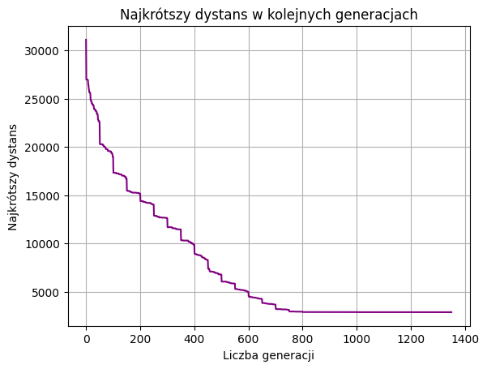

# Genetic-algorithm

Projekt przedstawia implementację algorytmu genetycznego służącego do rozwiązania problemu komiwojażera (TSP – Traveling Salesman Problem). Algorytm został zaprojektowany tak, aby znaleźć optymalną kolejność odwiedzenia 280 miast przy minimalnym dystansie podróży.

## Funkcjonalności
- **Problem komiwojażera**: Znalezienie optymalnej trasy odwiedzenia 280 miast, której suma odległości jest najmniejsza.
- **Inicjalizacja populacji**: Losowe generowanie początkowej populacji rozwiązań.
- **Selekcja**: Mechanizm wyboru najlepszych osobników na podstawie funkcji fitness.
- **Krzyżowanie (Crossover)**: Tworzenie nowych rozwiązań poprzez wymianę genów między rodzicami.
- **Mutacja**: Wprowadzenie losowych zmian w genotypie w celu zwiększenia różnorodności populacji.
- **Ewolucja populacji**: Powtarzalne generowanie nowych pokoleń aż do osiągnięcia zadowalającego wyniku lub przekroczenia liczby iteracji.
- **Zapis wyników**: Automatyczne zapisywanie wyników dostrajania algorytmu i najlepszej znalezionej trasy.

## Struktura plików
- `alg_genetyczny.ipynb`: Główny plik zawierający implementację algorytmu, wraz z analizą i wizualizacjami.
- `miasta280`: Plik tekstowy zawierający odległości między 280 miastami, zapisane w formacie macierzy odległości. Każda komórka zawiera odległość między odpowiednimi miastami.
- `wyniki_ga`: Plik tekstowy zawierający zapisane próby dostrojenia algorytmu wraz z:
  - Osiągniętymi wynikami (całkowity dystans trasy).
  - Optymalną kolejnością miast dla danego rozwiązania.
- **Najlepszy wynik**: Najlepsza trasa wygenerowana przez algorytm wynosi **2657 km**, co zostało zapisane w pliku `wyniki_ga`.

## Wymagania
Do uruchomienia projektu wymagane są następujące narzędzia i biblioteki:
- **Python 3.8+**
- **Jupyter Notebook**
- **Biblioteki Python**:
  - `numpy`
  - `matplotlib` (opcjonalnie, dla wizualizacji)

## Przykładowy wykres wygenerowany przez algorytm

